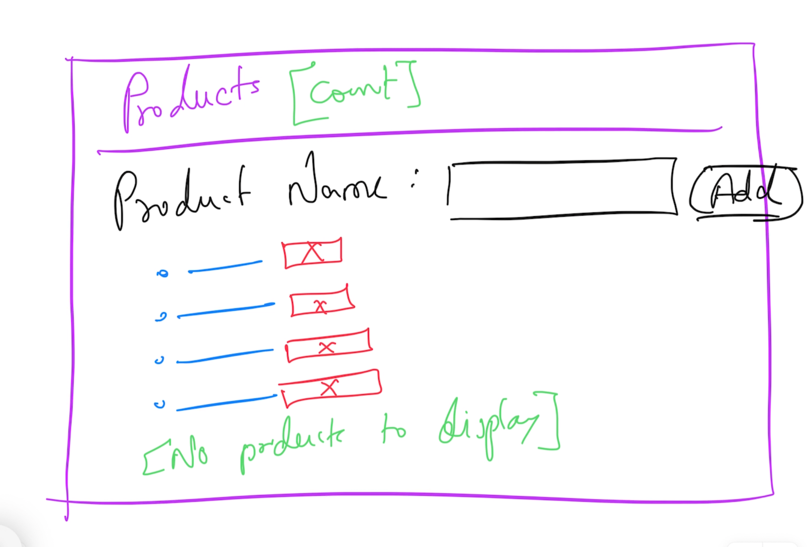

# React.js

## Magesh Kuppan

## Schedule
- Commence      : 9:00 AM
- Tea Break     : 10:30 AM (15 mins)
- Lunch Break   : 12:30 PM (1 hr)
- Tea Break     : 3:00 PM (15 mins)
- Wind up       : 4:30 PM

## Methodology
- No powerpoint
- Discuss & Code

## Repository
- https://github.com/tkmagesh/shell-react-may-2024

## Software Requirements
- Chrome Browser
- Visual Studio Code ( or any other editor)
- Node.js (LTS version - 20.10.x)
- Git Client

## React.js?
- Library for building Rich Internet Applications (SPA)

## Challenges in Bulding RIA
- SalaryCalculator
    - basic
    - hra
    - da
    - tax
- salary = basic + hra + da - tax

## JSX
- Every element MUST have the corresponding close element
- Use 'htmlFor' instead of 'for'
- Use 'className' instead of 'class'

## Hooks
- functions to handle side effects in React components
- function name must start with 'use'
- Can be used ONLY in a component function or in another hook function
- Built in hooks
    - useState
    - useEffects
    - useRef
    - useReducer
    - useMemo
    - useCallback

## Weekend Study
- Array Methods
    - forEach
    - filter
    - map
    - reduce

## Weekend Assignment
