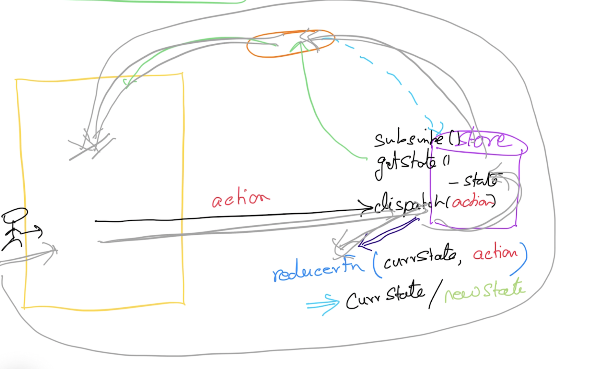

# React.js

## Magesh Kuppan
- tkmagesh77@gmail.com

## Schedule
- Commence      : 9:00 AM
- Tea Break     : 10:30 AM (15 mins)
- Lunch Break   : 12:30 PM (1 hr)
- Tea Break     : 3:00 PM (15 mins)
- Wind up       : 4:30 PM

## Methodology
- No powerpoint
- Discuss & Code

## Repository
- https://github.com/tkmagesh/shell-react-may-2024

## Software Requirements
- Chrome Browser
- Visual Studio Code ( or any other editor)
- Node.js (LTS version - 20.10.x)
- Git Client

## React.js?
- Library for building Rich Internet Applications (SPA)

## Challenges in Bulding RIA
- SalaryCalculator
    - basic
    - hra
    - da
    - tax
- salary = basic + hra + da - tax

## JSX
- Every element MUST have the corresponding close element
- Use 'htmlFor' instead of 'for'
- Use 'className' instead of 'class'

## Hooks
- functions to handle side effects in React components
- function name must start with 'use'
- Can be used ONLY in a component function or in another hook function
- Built in hooks
    - useState
    - useEffects
    - useRef
    - useReducer
    - useMemo
    - useCallback

## Weekend Study
- Array Methods
    - forEach
    - filter
    - map
    - reduce

## Weekend Assignment


## State Manager


## ES6 Modules
- Everything defined in a js/ts/jsx file is 'PRIVATE' by default
- Any public entity has to be explicity 'EXPORT'ed
    - The entities exported are assembled in a 'module' object and exported
- To use any public entity from another file, it has to be explicitly 'IMPORT'ed

## Bug Tracker application
```
src
    bugs
        actions
            createNew.js
            toggle.js
            remove.js
            removeClosed.js
            index.js
        reducers
            bugsReducer.js
        views
            BugStats.jsx
            BugEdit.jsx
            BugSort.jsx
            BugList.jsx
            BugItem.jsx
        index.js (Bugs component)
    store
        index.js (create the store)

```

## Homework
Create a 'Projects' module
- Add a new project
- List the projects

## Component
### Smart / Container Component
- Does not interact with the user
- Interfaces with the state manager and gets the data for the presentation components
- Prepares the action dispatchers to be used by the presentation components
- Advisable to have fewer Container Components

### Dumb / Presentation Component
- Gets the data from the Smart component and displays it to the user
- Gets the input from the user and invokes the given (from Smart component) function
- Can have as many as possible

## Middleware
- Encapsulate any logic that need not be executed for all the actions

## Async Operations in JavaScript
- callback
- Promise
- Async Await
- Generators
- Observables

## json-server
run the following command from the folder that has the 'db.json' file
```
npx json-server@0.17.4 db.json -p 3030
```

## axios
installation
```
npm install axios
```
usage
```
var p = axios.get('http://localhost:3030/bugs');
var p2 = p.then(function(response){
    return response.data;
})
p2.then(function(bugs){
    console.table(bugs);
})
```
```
axios.get('http://localhost:3030/bugs')
.then(function(response){
    return response.data;
})
.then(function(bugs){
    console.table(bugs);
})
```

```
const response = await axios.get('http://localhost:3030/bugs')
const bugs = response.data    
console.table(bugs);
```

## Recordings
- https://bit.ly/react-videos
- https://bit.ly/javascript-training-videos
- https://bit.ly/node-training-videos

## Books
- Refactoring
- Refactoring to Patterns
- Head First OOAD
- Growing Object Oriented Software Guided By Tests
- Agile Software Development: Principles Patterns & Practices
- DSL (any book)
- Functional Programming (any book)
